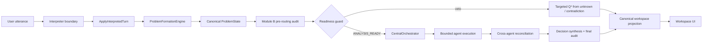
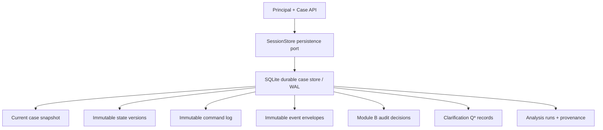

# Concierge 2.0 Architecture Audit

## Sprint 6 addendum — Human Financial Interaction Layer

The live runtime now has an explicit, read-only `InteractionRealizer` boundary after
canonical Q* selection. The authoritative sequence is:

`structured interpreter candidates → Problem Formation → Module B → prioritized structured Q* → InteractionRealizer → client language`

Q* retains its target Unknown IDs, contradiction identity, epistemic reason and selection
metadata. The realisation is presentation only: it receives the current Case and selected
Q*, returns an immutable client question, and has no mutation method or authority to create,
resolve, or reclassify state. Answers still return through interpretation and authoritative
runtime mutation before Module B re-audits the Case.

Question selection favours operational definition and decision-critical ambiguity, followed
by contradictions and analytical scope, then evidence convenience. Only one question is
selected per turn; closely related information can be expressed as one diagnostic step.
Evidence language explains the analytical purpose and names a small, context-relevant set of
records while retaining the shared `+Evidence` workflow. Contradiction language presents both
propositions and both evidence-reference sets without choosing either.

Technical depth adapts only from observable Case language, previous statements, explicit
role/context, and available financial artefact vocabulary. It never infers personality,
intelligence, education, emotion, or mental state. Hypotheses remain qualified possibilities;
the realizer cannot promote them to facts. Client language describes future capabilities as
analysis, modelling, planning, reconciliation, diagnostics, and forecasting—not bots or
assistant hand-offs—so capability routing can remain behind the Concierge.

**Sprint:** Sprint 1 — architecture audit  
**Audit date:** 2026-08-20  
**Scope:** `/concierge-lab`, its Next.js API bridge, the Python runtime in `entimema-ai`, deterministic fixtures, tests, and deployment documentation  
**Decision:** Preserve the epistemic and deterministic foundations, but do not treat the current live path as Concierge 2.0. The principal migration task is to connect the already-built domain pipeline to a durable, evented workspace runtime.

## 1. Executive Summary

The repository is substantially closer to the target philosophy than the current live product suggests. It already contains typed records for claims, evidence, unknowns, assumptions, hypotheses, contradictions and decisions; executable invariants; a deterministic Concierge state machine; a problem-formation engine; an independent epistemic controller with veto semantics; capability-based orchestration; three bounded analytical agents; reconciliation; synthesis; and a decision-map projection. These are strong assets and should be retained or refactored rather than rewritten.

The central architectural finding is a **wiring gap**. There are currently two materially different systems:

1. a rich, deterministic Python library exercised by tests and fixtures; and
2. a thin live HTTP path that invokes an LLM linguistic interpreter, appends extracted candidates directly to an in-memory `ProblemState`, asks at most one clarification question, and always stops before routing.

The live controller does **not** invoke `ConciergeStateMachine`, `ProblemFormationEngine`, `EpistemicController`, `CentralOrchestrator`, `AgentExecutionController`, `EndToEndRuntime`, or the canonical synthesis projection. Consequently, the strongest architecture exists but is not the architecture users execute.

### Bottom line

- **Conversation ≠ state:** conceptually and structurally **PARTIAL**. `ProblemState` is authoritative, but the interpreter receives the last ten conversation turns and the live controller does not use the canonical transition pipeline.
- **Declared problem ≠ operational problem:** **PARTIAL** in the library, but the live projection visually substitutes the declared problem when no operational problem exists. That presentation behavior **CONFLICTS WITH TARGET ARCHITECTURE**.
- **Unknown ≠ assumption ≠ zero:** **EXISTS** in typed foundations and invariant tests; ingestion and evidence parsers do not yet exist.
- **Claim ≠ fact:** **EXISTS** in the domain model and interpreter contract; the browser contract calls all `EvidenceRecord` values “validated evidence” without a distinct validation record, so end-to-end semantics are **PARTIAL**.
- **Behavioural signal ≠ mental state:** **EXISTS** as explicit guardrails and model instructions, though the live controller also uses brittle substring screening and must delegate final authority to Module B.
- **Epistemic Auditor with veto:** **EXISTS** as a deterministic library and projection contract, but is **MISSING from the live turn path**.
- **Hybrid Cognitive Workspace:** **PARTIAL**. The two-panel structure, problem-state cards and decision map exist; uploads, voice, evidence lifecycle, targeted node-driven clarification, accessibility-complete graph interaction and analysis-layer unlocking do not.
- **Persistence and production controls:** **MISSING**. Sessions are process-local and erased on restart; there is no database, object storage, authentication, tenant isolation, retention policy, malware scanning or durable audit log.

### Recommended architectural direction

Adopt one authoritative **Workspace Aggregate** with append-only commands/events and durable projections. Conversation is one source of commands, alongside evidence upload, node selection, human validation and agent results. A single application service should run this sequence on every command:

`admit command → interpret candidates where needed → validate command → evolve aggregate → run Module B → select one next action → persist atomically → publish projection`

Analysis should be a guarded phase/capability within the same workspace, never a handoff to another conversational persona.

---

## 2. Audit Method and Repository Scope

The audit inspected:

- the private Next.js page and all `components/concierge-lab` files;
- all Next.js `/api/concierge` route handlers and the runtime proxy;
- all non-test Python packages under `entimema-ai`;
- representative and contract-defining tests across state transitions, invariants, live API, interpreter, problem formation, epistemic control, orchestration, agents, reconciliation, synthesis, projections and end-to-end evaluation;
- runtime and deployment documentation, package manifests and recent repository history.

No production code was changed. This report is the only sprint artifact.

---

## 3. Current Architecture

### 3.1 Runtime topology

```text
Browser: /concierge-lab
  ├─ FIXTURE mode → local TypeScript snapshots (no backend)
  └─ LIVE mode
       → Next.js /api/concierge/sessions[/...]
       → runtime-proxy.ts (body limit, timeout, no-store)
       → ENTIMEMA_RUNTIME_URL
       → FastAPI /api/v1/sessions[/...]
       → InMemorySessionStore
       → LiveSessionController
       → LinguisticInterpreter
       → OpenAI Responses API (strict JSON schema)
       → direct ProblemState candidate admission
       → lightweight live projection (always blocked)

Separate deterministic library path (tests/evals, not live HTTP):
  ProblemFormationEngine / ConciergeStateMachine
       → EpistemicController (Module B)
       → CentralOrchestrator
       → registry-backed domain agents
       → CrossAgentReconciler
       → DecisionSynthesizer
       → final epistemic validation
       → DecisionWorkspaceProjection
```

### 3.2 Pages and routes

| Surface | Current responsibility | Observation |
|---|---|---|
| `app/concierge-lab/page.tsx` | Private, no-index page entry | Correctly isolated from public navigation and sitemap by contract test. |
| `components/concierge-lab/ConciergeLabShell.tsx` | Client-side mode, session, fixture step and display state | Owns many concerns in one component; all session state disappears on reload. |
| `POST /api/concierge/sessions` | Proxies session creation | Server-side boundary protects the Python runtime URL. |
| `POST /api/concierge/sessions/:id/messages` | Proxies a text turn | Supports optimistic state version checks via payload. |
| `POST /api/concierge/sessions/:id/reset` | Proxies reset | Backend reset creates a new session identifier, but the UI does not call this route; it clears local state instead. |
| FastAPI `POST /api/v1/sessions` | Creates in-memory fixture/live session | Fixture selection exists in the backend but browser fixture mode bypasses it. |
| FastAPI `GET /api/v1/sessions/:id` | Retrieves a session | No corresponding Next.js GET bridge or browser rehydration flow. |
| FastAPI message/reset endpoints | Mutate live session | Synchronous, process-local and not production-safe. |
| `GET /health` | Basic service/interpreter status | Useful for deployment; not a readiness/dependency health model. |

### 3.3 UI architecture

The page has a discreet “Bring the problem / Ask Entimema” intake, then a left conversation panel and right state workspace. The right side includes:

- operational problem and status;
- epistemic verdict/veto;
- claims, evidence, unknowns, hypotheses and contradictions;
- active agents and validated findings;
- final recommendations and synthesis;
- decision-map nodes and edges.

This is directionally the required Hybrid Cognitive Workspace, but current interaction is mostly read-only. Selecting a decision-map node changes local highlighting only. It does not send the node identity, generate `Q*`, focus the relevant state object, or create a traceable dialogue action. `selected_unknown_id` exists in the Python request schema but the UI does not send it and the controller does not consume it.

Fixture mode is more capable than live mode: it visually demonstrates agent execution, reconciliation and recommendations using predetermined TypeScript snapshots. Live mode supports text only and never advances to analysis. There is no `+Evidence`, file picker, upload progress, parsing review, voice capture, transcription, evidence validation workflow or explicit Analysis layer.

### 3.4 Client state management

State is local React `useState`/`useMemo`; there is no external store or server-component data model. The client stores:

- runtime mode;
- selected fixture and snapshot index;
- selected map node;
- live session ID and state version;
- current projection, displayed turns, draft message, busy flag and last runtime error.

This is adequate for a private lab. It is not adequate for resumable workspaces, multiple browser tabs, offline/retry semantics, event replay or collaborative access.

### 3.5 Conversation handling

The browser posts one text string and a random client turn ID. The live controller:

1. checks the session and optional state version;
2. enforces a user-turn limit;
3. supplies the last ten conversation views to the interpreter;
4. receives schema-constrained candidates;
5. copies and directly mutates `ProblemState`;
6. appends claims, explicit assumptions, embedded hypotheses and unknowns with UUIDs;
7. uses ambiguities or a repair candidate to emit at most one question;
8. appends user and Entimema conversation turns;
9. increments the state version and returns a blocked projection.

Positive properties are that the LLM cannot mutate state directly, output is schema validated, claims remain reported, unstated unknowns are not turned into assumptions, and the interpreter is explicitly not a router/calculator/final authority.

Important limitations:

- retries with the same `client_turn_id` are not idempotent and can duplicate records;
- candidates are appended without semantic de-duplication or provenance links to the originating message;
- corrections/retractions do not supersede earlier records;
- `ConversationTurnView.related_state_ids` remains empty;
- `selected_unknown_id` is unused;
- conversation context is a raw last-ten window rather than a deliberate interaction-context projection;
- the canonical state machine, formation engine and auditor are bypassed;
- no transition record/event is stored for live mutations;
- the assistant emits no response when no clarification is selected, which is structurally safe but experientially incomplete.

### 3.6 Domain state

`ProblemState` is a central Pydantic aggregate containing identifiers, user goal, declared and operational problem strings, decision context, claims, evidence, unknowns, assumptions, hypotheses, contradictions, constraints, entities, lifecycle, repairs, formation readiness, conversation context, next question, routing status, verdict and timestamps.

The aggregate correctly separates major epistemic categories. However, it mixes several responsibilities:

- problem-domain truth;
- dialogue/lifecycle state;
- routing readiness cache;
- auditor verdict cache;
- timestamps;
- nested conversation-context state.

Several concepts are represented only as strings (`operational_problem`, constraints, entity references, `decision_required`) even though richer typed objects exist elsewhere. The richer `OperationalProblem` from `problem_formation/engine.py` is returned by the formation engine but flattened back to a string in `ProblemState`. This loses structured object, goal, scope, horizon and relationship semantics at the shared boundary.

There are also duplicate or drifting vocabularies:

- `StateTransition` combines dialogue phases, execution phases, terminal failures and closure;
- `ProblemLifecycle` separately describes declared/structured/clarifying/hypothesis/operationalised/reopened status;
- `DecisionReadiness` separately describes blocked/analysis-ready/conditional/decision-ready;
- TypeScript independently duplicates Python projection enums and shapes;
- the fixture projection includes `reconciliation`, while the canonical Python projection does not expose the same field/shape.

### 3.7 LLM integration

The sole live model integration is `OpenAIInterpreterProvider`, which calls the OpenAI Responses API over a fixed HTTPS endpoint with:

- server-only API key and configured model;
- a single, focused interpreter contract;
- strict JSON-schema output;
- Pydantic validation after extraction;
- categorized provider, transport, refusal, envelope, JSON and schema failures;
- structured failure telemetry without logging user text or model reasoning.

This is a good constrained adapter rather than a monolithic “solve everything” prompt. It should be retained behind a provider interface. Risks include a blocking standard-library HTTP call inside a synchronous FastAPI path, no explicit retry/circuit breaker, no model/version record on admitted state objects, and raw recent conversation being embedded in the model request without a formal data-retention/redaction boundary.

### 3.8 Persistence and audit history

Persistence is explicitly absent. `InMemorySessionStore` uses a dictionary and process-local lock. Restart, scale-out or failover loses sessions and divergent workers cannot share state. No database schema, event store, snapshots, object storage, upload metadata, tenancy, authentication, authorization, retention, deletion, encryption policy or durable audit history exists.

Although `TransitionRecord` is well typed, `ProblemState` does not contain a transition collection and live turns do not produce/persist transition records. Audit records from Module B and orchestration are returned through library results, not durably attached to a workspace.

### 3.9 Problem formation and state machine

The deterministic library has two complementary mechanisms:

- `ConciergeStateMachine` governs dialogue-oriented transitions from intake through contextualising, repair, problem formation, hypothesis discrimination, epistemic challenge and routing readiness, with terminal stop states.
- `ProblemFormationEngine` preserves an immutable declared problem, scores candidate operational problems, requires confirmation for non-user reframes, binds evidence and hypotheses, assesses unknown materiality, checks hypothesis testability and recommends the next dialogue state.

These contain much of the target behavior and explicit guards. They are not composed into one transaction boundary, and neither is invoked by the live controller.

### 3.10 Epistemic Auditor (Module B)

`EpistemicController` is an independent deterministic validation service. Supporting modules assess:

- evidence provenance;
- claim support;
- assumptions and leakage from unregistered premises;
- contradictions and compatibility of definitions, scope, horizon and measurement;
- hypotheses and inference chains;
- traceability graphs;
- confirmation dependencies;
- forbidden socioanalytic/psychological inference;
- pre-routing, post-agent and final-synthesis admissibility.

It returns typed verdicts, blocking reasons, object identifiers and required next actions. The orchestrator explicitly refuses to plan when Module B vetoes. This is the correct institutional separation. Gaps are live-path integration, durable audit records, an explicit severity/materiality policy for contradiction veto, evidence-chain-break visualization, and robust automated numeric reconciliation at ingestion time.

### 3.11 Orchestration, agents and analysis

The `CentralOrchestrator` consumes a validated problem state and Module B result, decomposes explicitly requested capabilities, builds dependencies, matches registered agents by typed capability/input/horizon/population/method contracts, records rejected agents, handles semantic translations and produces `NO_ADMISSIBLE_AGENT` rather than falling back to a generic bot.

Three deterministic implementations exist:

- Finance working-capital/liquidity analysis;
- Credit Risk dimension-specific diagnostic without invented PD/aggregate score;
- Engineering exact-key reconciliation without fuzzy matching.

`AgentExecutionController` resolves references and validates every result. `CrossAgentReconciler`, `DecisionSynthesizer`, final epistemic validation and `DecisionWorkspaceProjection` complete a coherent library pipeline through `EndToEndRuntime`.

This is appropriate “agents behind one workspace” architecture. Its current limitation is that capabilities are externally requested by callers rather than derived through an auditable capability-selection command, and the pipeline is only test/evaluation reachable.

### 3.12 Upload and evidence handling

There is a strong typed `EvidenceRecord` and evidence relationship/provenance logic, but no ingestion boundary. The system cannot currently accept Excel, CSV, PDF, financial statements or supporting documents. Missing pieces include:

- object storage and malware scanning;
- file identity, hash, MIME/size validation and ownership;
- parser/OCR/table extraction jobs;
- source-page/cell/range anchors;
- normalized observations separated from source artifacts;
- human review and validation;
- versioning and supersession;
- evidence-to-claim/hypothesis/unknown relations;
- formula/unit/period/definition reconciliation;
- deletion and retention policy.

### 3.13 Deployment and operational concerns

The Python runtime is separately containerized and documents Cloud Run deployment. The Next.js proxy provides a body-size limit, request timeout and `no-store`. Missing production concerns include authentication between browser/workspace and runtime, service-to-service authentication, tenant authorization, rate limiting beyond turn count, distributed concurrency, durable idempotency, request correlation, metrics/SLOs, sensitive-data controls, backups, migrations and disaster recovery.

---

## 4. Architecture Gap Analysis

Status is assessed end-to-end, not merely by the presence of an unused class.

| Requirement | Status | Evidence and gap |
|---|---|---|
| Conversation is not state | **PARTIAL** | Separate `ProblemState` exists and raw history is not passed to agents. Live interpretation still uses an unstructured recent-turn window and bypasses state-machine events/provenance. |
| Declared problem differs from operational problem | **PARTIAL / CONFLICTS** | Both fields and a formation engine exist. Live never constructs a structured operational problem, and live projection substitutes declared text into the operational slot. |
| Unknown differs from assumption and zero | **EXISTS** | Separate records and explicit transition invariant exist. No ingestion layer yet proves that blank spreadsheet/PDF values remain unknown. |
| Claim differs from fact/evidence | **PARTIAL** | Claims and evidence are separate and claims have support states. “Fact” should not be a standalone truth object; validated proposition status should be auditor-issued and contextual. Browser currently labels all evidence records validated. |
| Behavioural signal differs from mental state | **EXISTS** | Guardrail rules, tests and interpreter contract prohibit psychoprofiling. Live substring screening is defense-in-depth, not a sufficient auditor. |
| State-machine execution engine | **PARTIAL** | Deterministic machine exists in the library; the live runtime implements a separate two-state approximation through direct mutation. |
| Operational problem formation | **PARTIAL** | Rich engine exists and is tested; it is disconnected from live and its structured result is flattened. |
| Explicit epistemic state | **PARTIAL** | Strong record types exist. Validation status, provenance, temporal validity and relations are spread across objects and result models rather than one consistent ledger. |
| Module B independence and veto | **PARTIAL** | Controller and orchestration veto are executable in library runtime; live turns never call them. |
| Contradiction detection | **PARTIAL** | Typed/assessed contradictions exist. Live interpreter does not create or audit contradiction records, and uploaded numeric mismatch detection is absent. |
| Evidence-chain-break detection | **PARTIAL** | Traceability graph validation exists. It is not maintained as the workspace’s canonical relation graph or shown live. |
| Mismatched totals | **PARTIAL** | Exact-key reconciliation agent exists for structured evidence; no file ingestion or automatic ledger/statement control checks exist. |
| Unresolved dependency detection | **EXISTS in library** | Orchestrator builds a DAG and rejects cycles/unresolved assignments; unavailable live. |
| Inconsistent assumptions | **PARTIAL** | Assumption assessment/leakage detection exists. Cross-scenario consistency and durable assumption lineage are not modeled end-to-end. |
| Veto forces readiness BLOCKED | **EXISTS in canonical projection** | Canonical projection maps blocking verdicts to `BLOCKED`; live is always blocked but does not use actual Module B. |
| Calm conflict UI with targeted question | **PARTIAL** | Fixture veto view is calm and structured. Live does not expose actual conflicting elements or bind a generated question to them. |
| Left conversation/capture panel | **PARTIAL** | Text conversation exists. No voice or multimodal capture. |
| `+Evidence` and supported documents | **MISSING** | No upload API, storage, parsing or review interface. |
| Asymmetric voice | **MISSING** | Neither hold-to-speak nor transcription exists; system is text-only, which at least avoids imprecise spoken financial output. |
| Right shared problem/epistemic state | **PARTIAL** | Required categories and decision map render. Assumptions and provenance are not first-class UI sections, and live data is incomplete. |
| Conversation ↔ state bidirectionality | **PARTIAL** | Conversation updates state. State/map selection does not generate commands or targeted questions. |
| Interactive decision map | **PARTIAL** | Selectable/highlighted visual list exists, but edges are not meaningfully interactive and selection has no runtime effect. |
| Analysis readiness gate | **EXISTS in library / MISSING live** | Routing and readiness contracts exist. Live cannot reach them. |
| Analysis layer in same workspace | **PARTIAL** | Fixture UI demonstrates continuity and backend specialists are headless. No live unlock/execute/result lifecycle. |
| Controlled specialist routing | **EXISTS in library** | Registry/capability matching and no generic fallback are strong. Requested capabilities still need a governed derivation path. |
| Durable workspace persistence | **MISSING** | In-memory only. |
| Authentication/tenant isolation | **MISSING** | Private preview is not a security model. |
| Idempotent commands and concurrency | **PARTIAL** | State-version mismatch is checked. Client turn IDs are not deduplicated and mutation/persistence are not atomic across processes. |
| Durable provenance/audit log | **MISSING** | Typed transition/audit objects exist but are not persisted or consistently connected to live records. |
| Evaluation and invariant coverage | **EXISTS** | Extensive deterministic tests/evals cover foundations. Production integration, persistence, ingestion and UI flows remain uncovered. |

---

## 5. Existing Module Classification

### 5.1 RETAIN

| Module | Why retain | Boundary changes allowed |
|---|---|---|
| `core/invariants.py`, `core/guardrails.py`, `core/validators.py` | Encodes non-negotiable semantic and transition constraints as executable policy. | Add ingestion and aggregate invariants; preserve deterministic authority. |
| Atomic domain records for claims, evidence, unknowns, assumptions, hypotheses and contradictions | Correctly resists semantic collapse. | Normalize provenance/status and relation references; do not merge categories. |
| `problem_formation` scoring, hypothesis eligibility, evidence binding and unknown materiality | Strong first-principles formation logic. | Put behind an application command handler and persist its outputs. |
| `epistemic` assessments and `EpistemicController` | Correct independent Module B foundation with veto authority. | Separate audit policy/configuration from execution and persist audit runs/findings. |
| Orchestrator registry, capability matching, dependency graph and semantic translation | Avoids generic fallback and uncontrolled handoffs. | Require a traceable capability-request derivation and version registry/contracts. |
| Deterministic specialist agents | Bounded, typed, evidence-referenced behavior matches target. | Execute asynchronously when appropriate; preserve input/output contracts. |
| Reconciliation, synthesis and evaluation harness | Maintains distinctions and final admissibility. | Unify projection contracts and add live/persistence evaluation cases. |
| Schema-constrained linguistic interpreter/provider interface | Properly limits LLM to candidate extraction. | Add redaction, version/model provenance, asynchronous client and policy telemetry. |
| Next.js server proxy pattern | Keeps runtime configuration/server credentials off client. | Add auth propagation, correlation IDs, GET/command coverage and generated contract types. |
| Private/no-index lab isolation | Correct during pre-production. | Replace with authenticated workspace access before broader exposure. |

### 5.2 REFACTOR

| Module | Why refactor | Target |
|---|---|---|
| `domain/problem_state.py` | Central state is useful but mixes aggregate, workflow caches and dialogue state; structured operational problem is flattened. | Versioned `WorkspaceAggregate` composed of problem, epistemic ledger, workflow and audit references. |
| `domain/transitions.py` | One enum mixes phases, failures and terminal outcomes. | Orthogonal `WorkspacePhase`, `DecisionReadiness`, `BlockerCode` and command/event types. |
| `concierge/state_machine.py` | Correct deterministic foundation but not integrated; transition ownership overlaps formation recommendations. | One authoritative transition reducer/application service consuming formation and audit outputs. |
| `problem_formation/engine.py` | Rich output is not the shared persisted model and duplicates readiness/state decisions. | Pure domain service returning proposed events/changes; state machine owns transition. |
| `live/controller.py` | Directly mutates state and recreates weak routing/repair rules. | Thin command application service orchestrating interpreter → domain reducers → auditor → persistence → projection. |
| `live/session.py` | Good dev abstraction but process-local and mutable. | Repository interface backed by transactional durable storage, optimistic versioning and event/idempotency tables. Keep in-memory adapter only for tests. |
| `live/response.py` | Lightweight projection diverges from canonical projection and substitutes declared for operational problem. | One versioned canonical projection builder used by all modes. |
| `synthesis/projection.py` | Strong content but hand-duplicated in TypeScript and oriented only to final synthesis. | Incremental workspace read model covering every phase, generated schema/client types and relation details. |
| `ConciergeLabShell.tsx` | Private lab works, but monolith owns transport, fixture engine and workspace UI. | Split session command hook, capture panel, epistemic panel, map, evidence drawer and Analysis layer. |
| `ConversationPanel.tsx` | Text channel is valid but lacks capture modes and state linkage. | Command-oriented capture with voice transcription and evidence controls; never own state truth. |
| `ProblemStatePanel.tsx` | Directionally correct but read-only and omits some epistemic/provenance concepts. | Object-specific actions, calm blockers, provenance, assumptions and validation controls. |
| `DecisionMapView.tsx` | Selection exists but is presentational. | Accessible graph/list projection issuing `SelectStateObject` / `RequestClarification` commands. |
| fixtures | Valuable deterministic UX/evaluation scenarios but manually duplicate contracts. | Generate from backend projection fixtures/contract snapshots to prevent drift. |
| API schemas | Useful strict boundary but only text-turn/session actions. | Versioned command API with discriminated command types and generated OpenAPI client. |

### 5.3 REPLACE

| Module/behavior | Why replace | Replacement |
|---|---|---|
| Direct candidate append logic in `LiveSessionController` | Bypasses canonical state machine, formation, auditor, transition records and deduplication. | Transactional workspace command handler using domain services and events. |
| Process-local `InMemorySessionStore` in deployed live runtime | Cannot survive restart or scale-out and has no tenant/audit guarantees. | Durable relational/event persistence plus object storage; retain adapter only in tests/local demo. |
| Independently handwritten browser projection contract | Python/TypeScript shape drift is already visible. | OpenAPI/JSON-Schema generated types with contract tests and explicit schema version. |
| Browser-only fixture state engine as representation of future functionality | Demonstrates outcomes but can conceal backend wiring gaps. | Server-produced deterministic scenario commands/projections, while retaining scenario content. |
| Substring-based live forbidden inference decision | Brittle and disconnected from the complete guardrail/auditor policy. | Candidate validation through core guardrails and Module B; optional substring filter only as defense-in-depth. |

### 5.4 REMOVE

These are behaviors to remove, not necessarily whole source files:

| Behavior | Reason |
|---|---|
| Live projection fallback `operational_problem = declared_problem` | Collapses two invariant concepts and falsely suggests operationalization. Return `null` plus formation status. |
| Duplicate transition/readiness authority across live controller, Concierge state machine and formation engine | Multiple authorities will diverge. Only the aggregate transition reducer may change workflow phase. |
| Unused request field behavior (`selected_unknown_id`) without command semantics | A decorative API field creates false capability. Implement it as a real command or remove it until supported. |
| UI reset that silently abandons a server session | Leaves unreachable server state and bypasses reset/audit semantics. Use an explicit reset/archive command. |
| Generic assistant/bot handoff patterns if introduced | Target requires one continuous workspace and capability routing behind it. None is currently needed. |

No current specialist agent, epistemic module or major domain package should be removed wholesale.

---

## 6. Proposed Domain Model

### 6.1 Modeling principles

1. **The workspace aggregate is authoritative; projections are disposable.**
2. **Epistemic kind, validation status and provenance are different dimensions.** Do not encode all three in one enum.
3. **A “fact” is not an ontologically permanent entity.** It is a proposition supported to a specified validation standard, scope and time.
4. **Absence is a value state, not a default primitive.** Optional transport fields must not silently mean zero/false/neutral.
5. **Every material relationship is explicit and addressable.** IDs must link messages, source artifacts, observations, claims, hypotheses, inferences and decisions.
6. **Commands express intent; events record accepted changes.** LLM output is a proposal, never an event by itself.

### 6.2 Aggregate and interaction entities

```text
DecisionWorkspace
  workspace_id, tenant_id, version, phase, readiness
  problem_definition
  epistemic_ledger
  interaction_context
  analysis_runs
  active_blockers
  last_audit_run_id

ConversationChannel
  channel_id, workspace_id, modality policy

InteractionTurn
  turn_id, actor, modality, content_ref, occurred_at
  command_id, related_object_ids, status

WorkspaceCommand
  command_id, workspace_id, expected_version, actor
  type, payload, idempotency_key, submitted_at

WorkspaceEvent
  event_id, workspace_id, aggregate_version, command_id
  type, payload, policy_version, occurred_at
```

`Conversation` should be renamed **ConversationChannel** or **InteractionStream** to prevent it being mistaken for state. `Message` should become **InteractionTurn**, because voice transcripts, system questions, upload notices and validation actions are not all ordinary chat messages.

### 6.3 Problem definition

```text
ProblemDefinition
  declared: DeclaredProblem
  operational: OperationalProblem?       # null until admitted
  candidate_operational_problems[]
  decision_context
  constraints[]
  relevant_entities[]

DeclaredProblem
  id, verbatim_text, originating_turn_id, declared_at
  supersedes_id?                          # correction preserves history

OperationalProblem
  id, formulation, object, target_question
  decision_to_support, goal, scope, horizon
  population, measure_definitions[]
  constraint_ids[], material_unknown_ids[]
  hypothesis_ids[], contradiction_ids[]
  status: PROPOSED | USER_CONFIRMED | ADMITTED | REOPENED | RETIRED
  formation_basis_relation_ids[]
  admitted_by_event_id, formation_policy_version
```

This replaces a bare operational-problem string and preserves why it differs from the declared statement.

### 6.4 Epistemic ledger

Use atomic **Propositions** and distinct records around them:

```text
Proposition
  proposition_id, normalized_statement, scope, time_basis
  units?, definition_ids[], subject_refs[]

Claim
  claim_id, proposition_id, claimant/source_ref
  originating_turn_id/artifact_id, reported_at
  claim_status

EvidenceArtifact
  artifact_id, filename, media_type, content_hash
  storage_ref, uploader, received_at, scan_status, parser_version

EvidenceObservation
  observation_id, proposition_id, artifact_id/source_ref
  locator (page/table/cell/range), extraction_method
  transformations[], reliability_assessment, observed_period

ValidationRecord
  validation_id, subject_type/id, standard, verdict
  validator_type/id, basis_relation_ids[], limitations[], valid_at

Hypothesis
  hypothesis_id, proposition_id, source
  observable_implications[], falsification_conditions[]
  status, support/contradiction relation ids

Unknown
  unknown_id, variable_definition, why_needed
  materiality, resolution_status, acquisition options
  blocker_policy, affected_object_ids[]

Assumption
  assumption_id, proposition_id, basis, owner
  scope, validity_window, scenario_only, validation_required
  originating UnknownAcceptedAsAssumption event id

Inference
  inference_id, proposition_id, method, model/version?
  premise_relation_ids[], uncertainty, causal_level, validation_id?

Contradiction
  contradiction_id, relation_ids/object_refs
  type, severity, materiality, status
  explanation, missing_evidence_ids/unknown_ids
  clarification_question_id?, resolution_event_id?

EpistemicRelation
  relation_id, source_ref, target_ref
  type, polarity, scope, method, created_by_event_id
```

### 6.5 Clarification, readiness, analysis and decision map

```text
ClarificationQuestion
  question_id, text, target_object_ids[]
  resolves_unknown_ids[], contradiction_ids[]
  expected_answer_shape, priority_basis, status
  selected_by_policy_version, answered_by_turn_id?

DecisionReadinessAssessment
  assessment_id, status: BLOCKED | FORMATION_READY | ANALYSIS_READY |
                         ANALYSIS_IN_PROGRESS | DECISION_SUPPORT_READY
  blocker_ids[], conditionality[], audit_run_id, assessed_at

AnalysisCapability
  capability_id, version, required_input_contract
  output_contract, supported scope/horizon/population/method
  consequentiality, enabled

AnalysisRun
  run_id, capability_id/version, input_snapshot_version
  task_ids[], status, output_refs[], audit_run_ids[]

DecisionOption / Recommendation
  id, proposition_id, supporting finding/relation ids
  assumptions[], unresolved_unknowns[], severity, reversibility
  human_decision_required

DecisionNodeProjection
  node_id, object_ref, presentation metadata only
```

`DecisionNode` should remain a **projection**, not another truth-bearing domain entity. The canonical graph is `EpistemicRelation`; the decision map is a user-specific read model derived from it.

---

## 7. Proposed State Machine

### 7.1 Separate phase from readiness and blockers

The current enum conflates lifecycle and failure. Replace it with orthogonal dimensions:

**Workspace phase**

```text
INTAKE
PROBLEM_DISCOVERY
EVIDENCE_GATHERING
EPISTEMIC_REVIEW
ANALYSIS
DECISION_SUPPORT
CLOSED
```

**Decision readiness**

```text
BLOCKED
FORMATION_READY
ANALYSIS_READY
ANALYSIS_IN_PROGRESS
DECISION_SUPPORT_READY
```

**Blocker codes** include `CLARIFICATION_REQUIRED`, `MATERIAL_UNKNOWN`, `MATERIAL_CONTRADICTION`, `TRACEABILITY_BREAK`, `UNSUPPORTED_CLAIM`, `UNVALIDATED_ASSUMPTION`, `NO_ADMISSIBLE_CAPABILITY`, `FORBIDDEN_INFERENCE` and `OUT_OF_SCOPE`.

`CLARIFICATION_REQUIRED` is therefore not a phase competing with `EVIDENCE_GATHERING`; it is a blocker/next-action that can occur in several phases. Likewise, `ANALYSIS_READY` is readiness, not a lifecycle phase.

### 7.2 Transition table

| From | Command/event | Guard | To | Auditor effect |
|---|---|---|---|---|
| `INTAKE` | `ProblemDeclared` | Non-blank, attributable turn | `PROBLEM_DISCOVERY` | Audit candidate claims/forbidden inferences; readiness blocked. |
| `PROBLEM_DISCOVERY` | clarification/evidence/constraint commands | Always through validation | remain | Recompute blockers and one `Q*`. |
| `PROBLEM_DISCOVERY` | `OperationalProblemAdmitted` | Explicit decision, object, scope/horizon sufficient; material definitions resolved; candidate confirmed when reframe is non-user-originated | `EVIDENCE_GATHERING` or `EPISTEMIC_REVIEW` | Module B may veto admission or immediately block readiness. |
| `EVIDENCE_GATHERING` | `EvidenceArtifactAccepted` / observations validated | Provenance complete; no silent coercion | remain or `EPISTEMIC_REVIEW` | Audit affected subgraph. |
| any non-closed phase | `UnknownAcceptedAsAssumption` | Explicit human action, basis, scope, materiality and scenario limits | remain | Record transition; critical unbounded assumptions remain blockers. |
| any non-closed phase | `ContradictionDetected` | Two traceable conflicting elements | `EPISTEMIC_REVIEW` | Critical/material finding activates veto. |
| `EPISTEMIC_REVIEW` | `AuditCompleted` | No critical veto; operational problem admitted; required evidence contract met; material unknown policy satisfied | readiness `ANALYSIS_READY`; phase remains `EPISTEMIC_REVIEW` | Module B signs assessment. |
| `EPISTEMIC_REVIEW` | `AnalysisRequested` | Readiness is `ANALYSIS_READY`; capability and inputs admissible; expected version matches | `ANALYSIS` | Pre-agent veto is final guard. |
| `ANALYSIS` | atomic agent result | Result schema valid and traceable | remain | Post-agent audit validates/rejects each result. |
| `ANALYSIS` | all tasks/reconciliation complete | Dependencies complete; synthesis passes final audit | `DECISION_SUPPORT` | Blocked or conditional results cannot masquerade as validated. |
| `DECISION_SUPPORT` | new material evidence/correction/contradiction | Changes a premise | appropriate earlier phase, usually `EPISTEMIC_REVIEW` | Reopen and invalidate stale downstream results by dependency. |
| any | `WorkspaceClosed` | Authorization and retention policy | `CLOSED` | Immutable close event; no destructive history rewrite. |

### 7.3 Required evidence is contract-specific

There should be no global rule such as “at least N evidence items.” Each `AnalysisCapability` declares required semantic inputs, definitions, periods, units and provenance quality. The readiness evaluator checks the operational problem against the intended capability contracts. A non-blocking unknown may remain visible and yield conditional analysis; a critical unknown affecting the target decision blocks.

### 7.4 Auditor veto conditions

Module B sets readiness to `BLOCKED` when any of the following is material to the requested analysis/decision:

1. forbidden behavioral/mental-state inference;
2. unresolved true or material definitional, scope, temporal, measurement or source contradiction;
3. missing or cyclic evidence/inference traceability;
4. unsupported material claim used as a premise;
5. unstated or unregistered premise/assumption leakage;
6. critical unknown, or high unknown marked blocking by capability policy;
7. incomplete evidence provenance or failed artifact integrity;
8. mismatched control totals not reconciled or explicitly scoped out;
9. unresolved task/capability dependency;
10. incompatible horizon, population, scope, method, unit or definition;
11. model output represented as observation, or hypothesis represented as conclusion;
12. stale analysis whose premise graph changed.

The veto response must include object IDs, a calm explanation, missing evidence/unknown references, and exactly one prioritized clarification or evidence request when the user can resolve it.

---

## 8. Epistemic State Model

### 8.1 Avoid one overloaded status enum

Represent at least four dimensions independently:

| Dimension | Examples | Purpose |
|---|---|---|
| **Kind** | claim, observation, calculation, model output, hypothesis, inference, assumption, unknown, decision | What sort of epistemic object is this? |
| **Provenance** | user reported, uploaded artifact, retrieved source, system calculated, model produced, human entered | Where did it come from? |
| **Validation** | unreviewed, admissible, supported, partially supported, contradicted, rejected, expired | What has Module B/human review established? |
| **Dependency role** | supports, contradicts, requires, derived from, assumes, supersedes | How does it affect other objects? |

### 8.2 Required category semantics

- **Known:** not a stored kind. A UI grouping for propositions with an admissible validation record within stated scope/time.
- **Unknown:** explicit unresolved variable with materiality and resolution policy; never encoded as `null`, `0`, `false` or empty string in calculations.
- **Claimed:** a sourced assertion. It remains a claim even when supported; validation attaches rather than rewriting its origin.
- **Validated:** a time-, scope- and standard-bound verdict attached to an object, not a provenance type.
- **Inferred:** a proposition derived from registered premises via a named method; it carries uncertainty and causal level.
- **Assumed:** an explicit scenario premise with basis and scope, created only by a traceable acceptance event.
- **Contradicted:** a validation/relationship outcome identifying both sides; it does not delete either proposition.

### 8.3 Preventing silent semantic collapse

- Use discriminated Pydantic models and forbid unknown fields.
- Use `UnknownValue`/`MissingValue` sentinels or nullable typed measures with mandatory absence reasons at calculation boundaries.
- Reject arithmetic on unresolved values unless a registered scenario assumption supplies the value.
- Never mutate `kind`; create a new derived object plus relation and validation event.
- Require all promotions to name source IDs, policy version, actor and basis.
- Preserve corrections through `SUPERSEDES`, never destructive overwrite.
- Validate references and aggregate version transactionally.
- Include epistemic kind and validation in every analytical input/output contract.
- Derive UI groupings from the ledger rather than letting UI labels redefine semantics.

---

## 9. Epistemic Auditor Architecture

### 9.1 Position and authority

Module B is a deterministic policy service operating on an immutable workspace snapshot and affected relation subgraph. It is invoked:

1. after candidate interpretation but before candidate admission where safety/type rules apply;
2. after every accepted state-changing command;
3. before analysis routing;
4. after each atomic agent result;
5. after reconciliation and before recommendations are exposed;
6. whenever a premise is corrected, superseded or invalidated.

The orchestrator cannot override it. Human acceptance may convert an unknown to an explicit assumption under policy, but cannot silently mark a contradiction resolved or reclassify evidence.

### 9.2 Components

```text
AuditCoordinator
  ├─ InvariantPolicy
  ├─ ProvenanceInspector
  ├─ ClaimSupportInspector
  ├─ ContradictionInspector
  ├─ NumericControlInspector
  ├─ AssumptionLeakageInspector
  ├─ UnknownMaterialityInspector
  ├─ CompatibilityInspector
  ├─ TraceabilityInspector
  ├─ ForbiddenInferenceInspector
  └─ Staleness/DependencyInspector

AuditRun
  input_workspace_version
  policy_bundle_version
  findings[]
  veto
  readiness_assessment
  next_action
```

Most inspectors have foundations in the current `epistemic` package. Numeric controls, artifact integrity and stale dependency invalidation are notable additions.

### 9.3 Veto contract

```json
{
  "active": true,
  "readiness": "BLOCKED",
  "finding_ids": ["audit-finding-123"],
  "conflicting_object_ids": ["claim-7", "observation-9"],
  "explanation": "The profitability measures use different definitions.",
  "missing_evidence_or_unknown_ids": ["unknown-profit-definition"],
  "next_action": {
    "type": "ASK_CLARIFICATION",
    "question_id": "question-14"
  }
}
```

The UI renders this as an ordinary work item, not an alarm. Severity determines gating, not visual drama.

---

## 10. Workspace Architecture

### 10.1 Application boundary

Introduce a versioned command API rather than a message-only API:

```text
POST /v2/workspaces
GET  /v2/workspaces/{id}
POST /v2/workspaces/{id}/commands
POST /v2/workspaces/{id}/artifacts:initiate
POST /v2/workspaces/{id}/artifacts/{artifactId}:complete
GET  /v2/workspaces/{id}/events?after=...
```

Example commands include `SubmitUtterance`, `SubmitTranscript`, `SelectStateObject`, `RequestClarification`, `AcceptUnknownAsAssumption`, `ValidateObservation`, `ResolveContradiction`, `RequestAnalysis`, `CancelAnalysis` and `CloseWorkspace`.

Every command has `command_id`, `idempotency_key`, `expected_workspace_version`, actor and payload. The server persists accepted events and new projection atomically, then returns the authoritative projection/version.

### 10.2 Left panel — capture

- discreet text intake and ongoing conversation;
- hold-to-speak recording with explicit start/stop, upload and transcription status;
- transcript shown for confirmation/correction before admission where material;
- `+Evidence` supporting CSV, Excel and PDF first;
- upload/scan/parse/review states;
- system responses primarily structured text/cards; no default system voice;
- each turn links to changed state objects and can show “what changed.”

### 10.3 Right panel — shared state

- structured operational problem with formation status and source basis;
- validated evidence observations with artifact locators;
- unverified claims;
- active hypotheses and falsification conditions;
- unknowns and explicit assumptions;
- calm contradiction/audit work items;
- decision readiness with reasons;
- interactive decision map derived from epistemic relations;
- Analysis layer that becomes available only on a signed `ANALYSIS_READY` assessment.

Selecting an unknown issues `SelectStateObject`; the backend chooses or creates a traceable `ClarificationQuestion` targeting that unknown. It is then rendered in the existing conversation channel. The UI must not independently invent `Q*`.

### 10.4 Analysis continuity

The Analysis layer is a workspace mode, not a new bot. Agent identity may appear as provenance (“Working Capital capability v1 produced this finding”), but the conversational actor remains Entimema. Progress, results, limitations and vetoes update the same state panels and decision map.

### 10.5 Persistence architecture

Recommended initial implementation:

- PostgreSQL for workspace metadata, commands, events, snapshots, objects, relations, audit runs and idempotency keys;
- object storage for encrypted source artifacts;
- background job queue for scan/parse/OCR/analysis;
- transactional outbox for reliable job/event publication;
- optimistic aggregate version plus row lock during command application;
- append-only domain events with periodic snapshots;
- explicit tenant/user ownership and authorization on every object;
- retention/deletion workflows that cover both database and artifacts.

Do not begin with a graph database. The graph is modest and relational adjacency tables plus indexed object references are sufficient. Re-evaluate only after real query evidence.

---

## 11. Migration Plan

### Stage 0 — Contract freeze and characterization

**Goal:** protect current behavior before changing wiring.

- freeze a v1 projection schema and document known drift;
- add contract snapshots for live empty/clarification/veto and end-to-end analysis projections;
- add architecture tests proving which controllers are invoked;
- retain fixture mode as a demonstration and regression oracle;
- record baseline eval scores and performance.

**Exit:** the existing lab and deterministic pipeline are reproducible from tests.

### Stage 1 — Domain model convergence

**Priority 1: domain model.**

- introduce versioned workspace aggregate, structured operational problem and epistemic relations;
- separate epistemic kind/provenance/validation;
- make message/state provenance links mandatory;
- define commands/events and idempotency contract;
- provide adapters from current `ProblemState` to avoid rewriting agents.

**Exit:** no live-facing code needs to flatten the operational problem or infer category from UI placement.

### Stage 2 — One authoritative state machine

**Priority 2: state machine.**

- separate phase, readiness and blockers;
- convert existing Concierge transitions and formation recommendations into one reducer/application flow;
- require every change to emit events/transition records;
- add re-open/invalidation semantics;
- replace direct live-controller mutations.

**Exit:** all text commands traverse the same deterministic state transition path used in tests.

### Stage 3 — Epistemic ledger and durable persistence

**Priority 3: epistemic state.**

- implement repository interfaces and PostgreSQL/event persistence;
- keep in-memory adapter for unit tests;
- add atomic expected-version/idempotency handling;
- persist state objects, relations, transition history and model interpretation metadata;
- add authenticated workspace retrieval/rehydration.

**Exit:** restart/scale-out does not lose or fork workspaces, and each displayed object has provenance.

### Stage 4 — Auditor in the live transaction

**Priority 4: auditor.**

- invoke Module B after every material command;
- persist audit runs/findings/policy version;
- bind veto to readiness and targeted next action;
- add numeric control and stale-dependency inspectors;
- ensure forbidden-inference policy is centrally enforced.

**Exit:** no live path can route or present analysis when a critical veto is active.

### Stage 5 — Workspace UI convergence

**Priority 5: UI.**

- generate browser types from API schema;
- split the lab shell into capture, state, map, blocker and analysis modules;
- make unknown/contradiction/evidence nodes issue commands;
- show operational problem as absent/proposed/admitted, never fall back to declared text;
- preserve calm visual language and accessibility;
- move fixture scenarios onto canonical server projection fixtures.

**Exit:** conversation and state are bidirectional and the UI has one source of truth.

### Stage 6 — Evidence ingestion

**Priority 6: ingestion.**

- implement direct-to-object-storage upload, scanning and content hashing;
- start with CSV, XLSX and text-based PDF; add OCR only with explicit quality states;
- separate artifacts, extracted observations and validation records;
- preserve page/table/cell anchors, transformations, units, periods and definitions;
- add review workflows and parser/adversarial fixtures.

**Exit:** missing cells remain unknown, extracted content remains unverified until admitted, and every observation traces to its artifact locator.

### Stage 7 — Analysis routing in the workspace

**Priority 7: analysis routing.**

- derive requested capabilities from operational problem via deterministic policy plus explicit user intent/confirmation;
- connect `EndToEndRuntime` components through jobs and workspace events;
- expose Analysis only when Module B signs readiness;
- stream/poll progress into the same workspace;
- invalidate results when premise relations change.

**Exit:** a live workspace reaches analysis and returns validated findings without bot switching.

### Stage 8 — Specialized integration and hardening

**Priority 8: specialized agents.**

- version registry/capability contracts;
- add only evidence-backed specialists with no generic fallback;
- expand cross-agent reconciliation and independence checks;
- add authorization, retention, observability, cost controls, redaction, backups and disaster-recovery tests;
- run safety/evaluation release gates in CI.

**Exit:** production-readiness criteria and service SLOs are met for a bounded launch scope.

---

## 12. Technical Risks

| Risk | Impact | Mitigation |
|---|---|---|
| Rich library/live path divergence | Safety rules appear implemented but are bypassed in actual use. | Make architecture integration tests assert the live command invokes formation, state machine and auditor. |
| Vocabulary/state drift | Invalid or ambiguous transitions and UI claims. | Orthogonal enums, schema versioning and generated clients. |
| Migration over-rewrite | Loss of well-tested domain logic. | Use adapters and strangler migration around `ProblemState`; refactor boundaries before internals. |
| Event model complexity | Slower initial delivery. | Keep one aggregate and relational event log; avoid premature microservices/CQRS infrastructure. |
| Evidence parser error | Extracted values may be treated as truth. | Artifact/observation/validation separation, locators, confidence and human review. |
| Unknown coercion in analytics | Silent financial error. | Typed missing-value reasons and calculation preconditions; adversarial spreadsheet tests. |
| LLM candidate overreach | Unsupported claims/hypotheses enter state. | Candidate-only adapter, deterministic admission, provenance and auditor checks. |
| Retry duplication/races | Duplicate claims and diverging workspace state. | Idempotency table plus optimistic version and atomic transaction. |
| Stale analysis | Recommendations survive changed premises. | Dependency graph invalidation and snapshot/version-bound analysis runs. |
| Sensitive financial documents | Confidentiality/regulatory exposure. | Tenant auth, encryption, least privilege, malware scan, retention/deletion and redaction policy. |
| Overblocking | Workspace becomes unusable under conservative veto. | Materiality/capability-specific policies, conditional outcomes and explainable one-step resolution. Never weaken hard invariants. |
| Underblocking due to heuristic screening | Psychoprofiling or unsupported conclusions leak through. | Central Module B evaluation at pre-route, post-agent and synthesis stages. |
| UI graph overload | Decision map becomes decorative or unreadable. | Progressive disclosure, filters, accessible list alternative and user-task testing. |
| Fixture/live illusion | Stakeholders infer implemented capabilities from snapshots. | Clearly label fixtures and make readiness dashboards distinguish demo versus integrated capability. |
| Sync model/network calls | Worker exhaustion and latency. | Async client, bounded timeouts, circuit breaker and background jobs where turns need not block. |

---

## 13. Recommended Implementation Sequence

1. **Write characterization and schema-contract tests.** Do not change UX first.
2. **Create the structured workspace aggregate and epistemic relation model** with adapters to current `ProblemState`.
3. **Unify transition ownership** and route live `SubmitUtterance` through the existing interpreter and canonical deterministic services.
4. **Integrate Module B in-process before persistence rollout** so the live path immediately stops bypassing veto.
5. **Add durable command/event/idempotency persistence** and authenticated rehydration.
6. **Replace live and final projection builders with one incremental, versioned builder** and generate TypeScript types.
7. **Enable bidirectional node commands** (`Unknown → Q*`) and expose explicit assumptions/provenance.
8. **Build evidence ingestion** with CSV/XLSX/text-PDF before OCR-heavy documents.
9. **Connect readiness to asynchronous analysis execution** using the existing orchestrator/agent/reconciliation pipeline.
10. **Harden security, observability, evaluation and recovery** before widening access.

The first implementation sprint should not add new agents. It should prove that one live utterance can create traceable candidates, traverse the canonical state machine, receive a Module B audit, persist atomically and rehydrate into a canonical workspace projection.

---

## 14. Acceptance Criteria for Concierge 2.0

### State and problem formation

- [ ] Conversation turns can be deleted from a read projection without losing the machine-readable problem state.
- [ ] Every state mutation originates from an accepted command and durable event.
- [ ] Declared problem remains verbatim and separately traceable from all operational formulations.
- [ ] Operational problem is a structured, admitted object; the UI never substitutes declared text for it.
- [ ] Corrections supersede objects without destroying history.
- [ ] Phase, readiness and blockers are distinct fields with valid transition guards.

### Epistemic integrity

- [ ] Unknown, assumption, claim, observation/evidence, hypothesis and inference are distinct discriminated records.
- [ ] Missing numeric/boolean data cannot enter calculations as zero/false without an explicit assumption event.
- [ ] Claims become supported only through resolvable evidence relations and validation records.
- [ ] Model outputs cannot be relabeled observations.
- [ ] All material inferences and recommendations have reconstructable evidence and inference paths.
- [ ] Behavioural/language/voice signals never establish stress, deception, personality, intent, mental state, fraud, protected characteristics or trustworthiness.

### Auditor and readiness

- [ ] Module B runs after material commands, before routing, after atomic agent results and before final recommendations.
- [ ] Critical/material contradictions force `DecisionReadiness = BLOCKED`.
- [ ] A veto contains conflicting object IDs, explanation, missing evidence/unknown IDs and one targeted next action.
- [ ] No orchestrator, agent or human-facing projection can override an active hard veto.
- [ ] Resolved vetoes retain their audit history and resolution basis.
- [ ] Changed premises invalidate affected readiness assessments and analysis results.

### Workspace interaction

- [ ] Left panel supports text, confirmed voice transcription and `+Evidence` without making conversation the state store.
- [ ] System output remains primarily visual/text.
- [ ] Right panel exposes admitted operational problem, validated evidence, unverified claims, hypotheses, unknowns, assumptions, contradictions, readiness and decision map.
- [ ] Selecting an unknown can create a server-side, traceable `Q*` in the conversation channel.
- [ ] Every conversation turn can identify which state objects it created, changed or addressed.
- [ ] Analysis unlocks in the same workspace only when readiness is `ANALYSIS_READY`.
- [ ] Agent identity is provenance, not a visible bot handoff.

### Evidence

- [ ] CSV, XLSX and supported PDFs have secure upload, scan, hash, ownership and retention metadata.
- [ ] Extracted observations preserve source page/table/cell/range and parser/transformation versions.
- [ ] Uploaded statements remain unverified until validation; uploaded files are not facts.
- [ ] Mismatched totals, units, definitions and periods produce explicit findings/unknowns rather than silent normalization.
- [ ] Parser failures and blanks preserve Unknown.

### Persistence, security and operations

- [ ] Workspace state survives restart, failover and horizontal scaling.
- [ ] Commands are idempotent and concurrent stale writes receive deterministic conflict responses.
- [ ] Tenant/user authorization applies to workspaces, turns, artifacts, events and analysis runs.
- [ ] Durable audit logs record actor, command, event, model/provider version where applicable, policy version and aggregate version.
- [ ] Sensitive data has encryption, deletion, retention and access-log controls.
- [ ] Health, metrics, tracing, alerts, backups and recovery procedures cover runtime, database, object storage, queue and model provider.

### Quality gates

- [ ] Python unit/integration/evaluation suites pass, including hard S5/forbidden-inference/traceability gates.
- [ ] TypeScript, lint and production build pass.
- [ ] API schema compatibility and generated-client checks pass.
- [ ] End-to-end tests cover intake, clarification, evidence upload, unknown selection, contradiction veto, assumption acceptance, analysis unlock, agent result validation, premise change and rehydration.
- [ ] Accessibility tests cover keyboard/screen-reader use of conversation, state objects, veto work items and decision map.

---

## 15. Final Architectural Decision Record

**Retain** the deterministic domain, invariant, epistemic, orchestration, specialist-agent, reconciliation and synthesis foundations.  
**Refactor** them behind one versioned workspace aggregate, command handler and canonical projection.  
**Replace** direct live mutation, in-memory deployed persistence and handwritten cross-language contracts.  
**Remove** declared-to-operational fallback and duplicate transition authority.  

The repository does not need another chatbot layer or a new visual language. It needs to make its existing epistemic architecture the actual live execution path, then add durable evidence-aware workspace infrastructure around it.

---

## 16. Sprint 2 Implementation Companion — Canonical Live Runtime

The live message controller is now an adapter. It authenticates the session/version,
invokes the linguistic interpreter, maps its immutable candidate into an
`ApplyInterpretedTurn` command, and delegates all domain work to
`CanonicalConciergeRuntime`. It does not assign an operational problem, readiness,
blockers, phase, or epistemic verdict.



### Authority and retained modules

- `ProblemFormationEngine` alone admits an operational formulation; absence remains
  `null` and the projection never falls back to declared text.
- `CanonicalConciergeRuntime` is the live command/reducer and phase/readiness authority.
  Workspace phase, decision readiness and blocker codes are orthogonal aggregate fields.
- Module B runs after formation and before readiness. Its veto is a hard analysis guard.
- Existing capability matching, bounded agents, post-agent validation, reconciliation and
  synthesis are retained behind `EndToEndRuntime`; specialist identity is provenance, not
  a conversational handoff.
- Conversation turns remain a separate session log. The right-side projection is produced
  from `ProblemState` plus signed audit/analysis results, never from message parsing in the
  browser.

### Mutation, contract and persistence boundaries

The interpreter can only propose schema-validated candidates. The typed command boundary
creates epistemically distinct records, the formation engine validates and merges them,
and Module B recomputes blockers before the state is saved. Pydantic is authoritative for
the touched runtime contracts; `scripts/export_runtime_schema.py` exports the checked-in
cross-language JSON Schema.

The controller and API router now depend on the `SessionStore` port rather than the
process-local implementation. `InMemorySessionStore` remains the development adapter; a
durable database adapter can replace it without changing domain execution.

### Remaining migration work

At the close of Sprint 2, durable event/snapshot persistence, idempotency records, artifact
ingestion, ownership and authorization were not implemented. Sprint 3 addresses the first
three persistence-boundary concerns as documented below. The older dialogue
`StateTransition` field remains for compatibility with deterministic tests and fixtures,
but it is not used as live readiness authority. Fixture scenarios remain explicitly gated
behind fixture mode and do not enter live free-text execution.

---

## 17. Sprint 3 Implementation Companion — Durable Decision Intelligence Cases

The persistence boundary now treats a live workspace as a `ConciergeCase`, exposed through
the compatibility `LiveSession` API name while clients migrate to case terminology. The
aggregate owns identity (`case_id`), owner and tenant references, timestamps, status,
schema/version metadata, conversation reference/log, current canonical `ProblemState`, and
projection. Workspace phase, readiness, and blockers remain authoritative inside
`ProblemState` and are not duplicated as independently mutable case fields.



### Adapter and transaction model

`SQLiteSessionStore` is the production default and uses only the Python standard library,
fitting the separately deployable runtime without an ORM/platform migration. SQLite WAL
supports durable restart recovery and a single `BEGIN IMMEDIATE` transaction atomically
advances the current snapshot and appends its state version, command, events, audit,
clarification, and optional analysis run. `InMemorySessionStore` remains for deterministic
tests and explicitly local development.

Each mutation loads version N and commits N+1 with an expected-version predicate. A
different stored version raises typed `StaleCaseVersionError`; the controller maps this
expected conflict to `409 STALE_STATE`. Missing cases remain explicit `404` results rather
than causing replacement-case creation. Other typed persistence errors leave room to map
invalid commands, rejected domain transitions, idempotency misuse, and infrastructure
failure separately.

### Commands, idempotency, and events

Commands are keyed by `(case_id, command_id)`. A completed retry returns the serialized
original response before interpretation and cannot create another snapshot, event, audit,
clarification, or analysis run. Accepted command records contain type, source, actor,
correlation ID, expected version, structured Pydantic command payload, processing result,
timestamp, and schema version. They never contain hidden model reasoning.

Meaningful changes use append-only, schema-versioned envelopes with event ID/type, case and
case version, command, actor/source, correlation/causation, occurrence time, and structured
payload. The initial event is `CaseCreated`; live turns emit `CaseStateAdvanced`, readiness
changes emit `DecisionReadinessChanged` with blockers added/cleared, and generated Q* emits
`ClarificationRequested`. This is pragmatic snapshot-plus-logs persistence, not pure event
sourcing.

### Audit, clarification, analysis, and provenance

Every accepted live turn stores the structured Module B verdict, audited state version,
blockers, contradiction IDs, critical unknown IDs, evidence-chain violation codes,
readiness, and record references. This is the reviewable evidence basis for an admission or
veto, not chain-of-thought. Readiness events link their causation to that audit.

Clarification records retain source unknown/contradiction identifiers, exact Q*, state
version, open/resolution status, answer reference, and timestamps. Analysis runs retain the
exact input version, requested capabilities, orchestration admission, bounded capabilities,
status, command provenance, reconciliation, synthesis, final admissibility, and execution
times. Agent identifiers remain provenance only.

### Recovery, ownership, retention, and evolution

A new adapter instance can open the same database and validate the complete case snapshot;
version histories reconstruct prior canonical states and logs explain meaningful changes.
All case tables cascade from the case identity, providing a deterministic deletion hook;
separate artifact kinds permit future differentiated audit/legal retention policies.
Owner and tenant columns establish the authorization boundary, and owner-scoped loads hide
another principal's case as not found. Authentication and policy enforcement at the API
edge remain follow-up work.

Major snapshots, commands, and artifacts carry `schema_version = 1`. Loading passes through
an explicit migration hook; future releases must add backward-compatible transformations
rather than assuming stored JSON never changes.

The legacy `ProblemState.lifecycle_state: StateTransition` is now documented in code as
fixture compatibility only. Persistence serializes it only as part of the canonical state
snapshot and never reads it to determine phase, readiness, blockers, concurrency, events,
or analysis admission. Remove it after legacy dialogue fixtures migrate.

### Remaining evidence-storage work

Evidence binary/object storage, upload scanning, content hashes, extraction coordinates,
encryption/key policy, access logging, database backups/failover, tenant authentication,
formal retention scheduling, and legal holds remain outside this sprint. SQLite is a
production-capable single-node adapter; horizontally scaled deployments should implement
the same `SessionStore` transaction contract on the existing managed relational platform
when one is selected.

## Sprint 4 — Evidence architecture and multimodal intake

### Boundary and invariants

Evidence intake is part of the canonical Case runtime, not a document-chat or RAG subsystem. The architecture explicitly separates `Artifact`, `EvidenceCandidate`, and validated `Evidence`: transport and extraction never assert truth. A missing CSV/XLSX value is omitted rather than coerced to zero, and an XLSX formula result retains its formula and is labelled `FORMULA_RESULT`, distinct from `HARDCODED`.

`Artifact` records carry Case, owner and tenant identities, original filename, declared media type, byte size, SHA-256 digest, upload time, stable storage reference, processing/security statuses and schema version. Artifact identity is UUID-based, never filename-based; hash deduplication is scoped to a Case.

### Artifact storage and security

`ArtifactStore` is the cloud-neutral binary port. `LocalArtifactStore` is the development adapter and stores opaque UUID-named objects outside both `ProblemState` and SQLite. A future GCS, S3-compatible, or Azure adapter implements the same put/get/case-retention boundary. The default retention policy follows the Case lifecycle; the adapter exposes case deletion so an application deletion coordinator can remove binaries without orphaning them.

Registration validates non-empty and maximum size, supported MIME type, filename extension consistency, and PDF/XLSX signatures. XLSX extraction applies entry-count and expanded-size container limits. `MalwareScanner` is an explicit production hook; the development scanner reports `NOT_SCANNED` and never pretends trust. Encryption-at-rest remains adapter-managed. API access checks Case owner and tenant before attachment, processing, or projection. Access logging and a production scanner/object-store are deployment responsibilities behind these ports.

### Extraction and provenance

Each attempt creates an immutable `ExtractionRecord` with extractor identity/version, timestamps, status, metadata, structured-output reference, errors and warnings. Structured payloads live in dedicated durable evidence tables rather than Case snapshots.

* PDF extraction reads deterministic text-layer blocks and records 1-based page plus block region. Image-only PDFs remain unverified with an explicit OCR warning; OCR is a future extractor.
* XLSX extraction parses the OOXML package, recording worksheet, cell, raw value, displayed/shared-string value, formula, data type and hardcoded/formula-result identity.
* CSV extraction detects UTF-8/BOM, delimiter and headers, and records physical row and named column for every non-missing value.

`EvidenceSource` links every candidate and admitted Evidence object to artifact, extraction record, and normalized `EvidenceLocation`. Explicit typed relations support `SUPPORTS`, `CONTRADICTS`, `DERIVES_FROM`, `VALIDATES`, `SUPERSEDES`, and `RECONCILES_WITH`; callers must record these relationships rather than relying on an LLM inference.

### Admission, Module B, Unknowns, and Q*

Extraction only creates candidates in `UNVERIFIED`. Controlled validation records one of `VALIDATED_EVIDENCE`, `UNVERIFIED`, `CONTRADICTED`, `REQUIRES_CLARIFICATION`, or `REJECTED`, its human/system validator and rationale. Validated admission advances the optimistic Case version. Evidence conflicts remain structured contradictions: neither a user claim nor an evidence value is silently overwritten. Module B can block on these relations, and the canonical question selector derives targeted Q* from contradiction identifiers rather than document text.

An optional Unknown target on admission creates an immutable `UnknownResolution` containing Unknown, Evidence, Artifact, time and Case version. The Unknown's history is retained rather than deleted. Workspace projection exposes artifact status, validated and unverified evidence, evidence contradictions, and resolution history; browsers do not reconstruct epistemic state.

Analysis-run records now identify input state version and exact evidence IDs, artifact IDs, and extraction IDs available in canonical evidence provenance. This makes later analysis reproducible after reload. Registration and processing use command IDs and Case-scoped content hashes, while completed extraction lookup prevents duplicate canonical candidates. SQLite/WAL preserves all metadata across process restart.

### Remaining production adapters

The first intake path deliberately does not provide OCR, legacy XLS, DOCX, images, API/ERP ingestion, cloud object storage, antivirus infrastructure, customer KMS integration, or automated retention scheduling. Those capabilities attach to the existing ports and processing states without changing the domain model. Case deletion needs an application-level coordinator to invoke both durable metadata deletion and `ArtifactStore.delete_case`; no irreversible automatic deletion is enabled by default.

## Sprint 5 — Decision Intelligence Workspace

### Workspace component architecture

`ConciergeLabShell` owns transport continuity and composes two deliberately separate surfaces: the Case notebook (`ConversationPanel`, including evidence capture) and the canonical Shared Problem State (`ProblemStatePanel` and `DecisionMapView`). The discreet intake expands only after a Case is created or a deterministic canonical projection is selected. Conversation is never used to reconstruct state.

### Projection-to-UI flow

The browser creates or reloads a durable Case through the Next.js runtime proxy. The returned `workspace_projection` is passed without epistemic reinterpretation to state, readiness, evidence, contradiction, map, and analysis views. Local storage retains only the durable Case identifier needed for recovery; conversation, readiness, objects, and versions are restored from `GET /sessions/{case_id}`. Formatting functions render canonical enum labels and provenance but do not infer status.

### Object interactions

- **Decision Map:** lightweight semantic buttons are generated solely from canonical nodes and relationships. Keyboard selection opens the same object context used by the state panels.
- **Unknown → Q\*:** selecting a canonical Unknown records its ID, focuses the canonical `clarification_target` in the Case notebook, and submits `selected_unknown_id` with the user's answer. No UI-authored clarification is created.
- **Evidence provenance:** validated evidence expands progressively to its artifact and PDF page, XLSX sheet/cell/formula, or CSV row/column location. Artifact processing status is displayed from the evidence projection.
- **Contradictions:** inspection preserves both propositions side by side and explicitly avoids privileging either source; the canonical epistemic control supplies the clarification requirement.

### Analysis Ready and continuity

The Analysis layer remains locked until the canonical readiness is `ANALYSIS_READY` (or an existing canonical analysis run/capability is projected). It expands in the same Case and supports capability status, input state version, final admissibility, audited findings, and synthesis. Specialist IDs are secondary technical provenance rather than a bot-handoff model. Further conversation and evidence remain available after analysis.

### Responsive and accessible behavior

Desktop uses a persistent notebook/state split. Large tablets retain the split with denser single-column state sections; narrow screens prioritize Shared Problem State before the notebook. Native buttons, details/summary disclosure, labelled controls, status regions, keyboard-selectable map nodes, and visible focus rings provide the interaction baseline.

### Remaining UX/product gaps

Speech transcription is intentionally represented as a disabled boundary until a transcription service exists. The current Decision Map presents typed topology as grouped semantic nodes rather than drawing connectors; larger cases may need list virtualization and relationship filtering. Evidence admission controls and contradiction-resolution commands remain backend-led follow-up work. Authentication and a multi-Case index are required before durable Case recovery can move beyond a single anonymous Case identifier.
